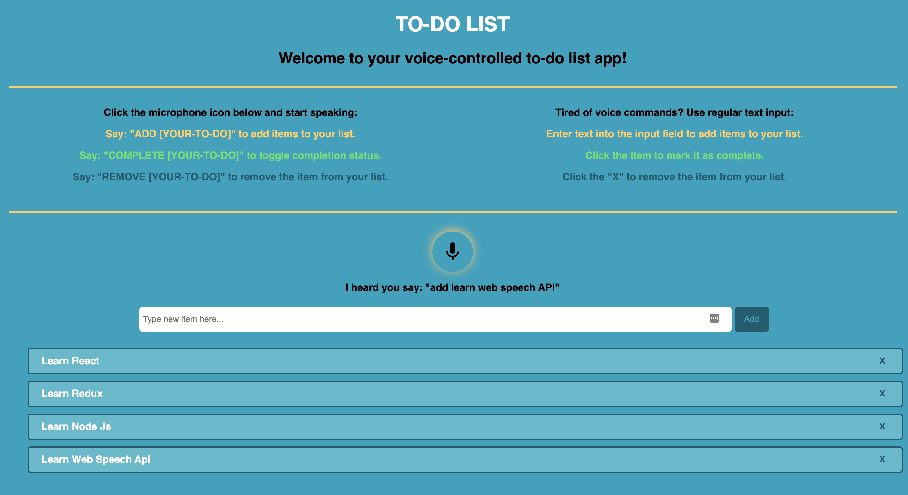

# TellMeWhat-To-Do

A voice-controlled to-do list application

## Overview
I built TellMeWhat-To-Do as part of a 4-day hackathon while attending the Grace Hopper coding bootcamp.

I wanted to make the app accessibile to people with limited mobility in their extremities, and fun to use for those who prefer speaking to typing.

My application is a variation of your typical to-do list - *with a twist:* in addition to typing into the input fields, users can utilize voice commands to add and delete items from the list as well as mark them complete.

## Technologies

PostgreSQL, NodeJS, React/Redux, Web Speech API

## Development Mode Setup & Installation

1. Create a local Postgres database named 'tellmewhattodo'.

     createdb tellmewhattodo

2. Install all node.js dependencies:

     npm install

3. Start the app in dev mode:

     npm run start-dev

## Preview

